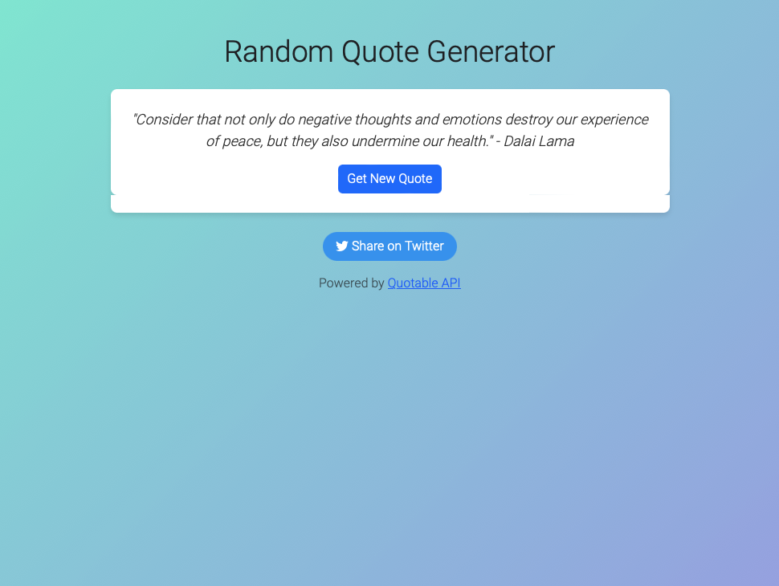

# Random Quote Generator

A web application that displays random quotes fetched from an API when the user clicks a button.

## Table of Contents

- [Introduction](#introduction)
- [Project Requirements](#project-requirements)
- [Technologies Used](#technologies-used)
- [Skills and Knowledge Applied](#skills-and-knowledge-applied)
- [How to Deploy](#how-to-deploy)
- [Contributing](#contributing)

## Introduction

This project aims to create a simple web application that provides users with random inspirational quotes. Users can click a button to fetch a new quote, and they have the option to share the quote on Twitter. The application is designed to be visually appealing, responsive, and user-friendly.

## Project Requirements

- Display a random quote when the user clicks the "Get New Quote" button.
- Allow users to share the displayed quote on Twitter.
- Provide a visually appealing and responsive user interface.
- Fetch quotes from an external API (Quotable API).
- Implement error handling to show user-friendly error messages.

## Technologies Used

- HTML: Provides the structure of the web page.
- CSS: Styles the web page and creates a visually appealing UI.
- Bootstrap: Used for styling and creating a responsive design.
- JavaScript: Handles the logic of fetching and displaying quotes.
- Fetch API: Used to make HTTP requests to the Quotable API.
- Twitter API: Allows users to share quotes on Twitter.
- Google Fonts: Enhances the visual design with custom fonts.

## Skills and Knowledge Applied

- JavaScript: Demonstrates skills in asynchronous programming, error handling, and DOM manipulation.
- Web Development: Shows knowledge of building a responsive and visually appealing web application.
- API Integration: Illustrates the ability to fetch and use data from external APIs.
- Error Handling: Implements error handling practices for a smoother user experience.

## How to Deploy

To deploy this project locally, follow these steps:

1. Clone the repository to your local machine.
2. Open the project folder in your code editor.
3. Open the index.html file in a web browser to view the application.

## Contributing

Contributions are welcome! If you'd like to contribute to this project, please follow these steps:

1. Fork the repository.
2. Create a new branch for your feature or bug fix: `git checkout -b feature/new-feature`
3. Make your changes and commit them: `git commit -m 'Add new feature'`
4. Push to the branch: `git push origin feature/new-feature`
5. Submit a pull request.
